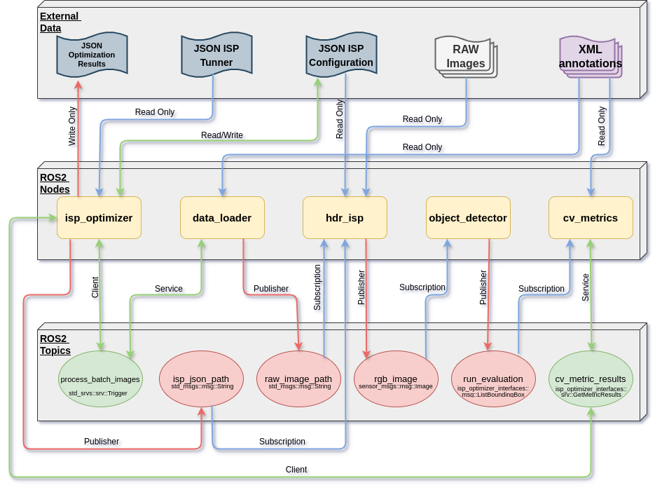

# ROS 2 ISP Optimizer

`ISP Optimizer` is a ROS 2 package that provides a set of nodes that allows the ISP optimization using RAW images as input.
PENDING.

## Computational Graph



## Prerequisites

* [ROS 2 Humble](https://docs.ros.org/en/humble/index.html) environment - follow [installation instructions](https://docs.ros.org/en/humble/Installation.html) for your system
* Install colcon:
    ```
    sudo apt install python3-colcon-common-extensions
    ```
* Nvidia drivers:
    ```
    sudo ubuntu-drivers autoinstall
    reboot
    nvidia-smi
    ```
* [CUDA Toolkit 12.1](https://developer.nvidia.com/cuda-12-1-0-download-archive?target_os=Linux&target_arch=x86_64&Distribution=Ubuntu&target_version=22.04&target_type=deb_network) or another compatible version with pytorch.

* The following python libraries:
    ```
    pip3 install torch torchvision torchaudio torchmetrics scikit-optimize cma pylabel opencv-python ultralytics matplotlib pillow numpy PyYAML scipy thop tqdm psutil requests pycocotools
    ```
* Download the [RAW dataset](https://mega.nz/file/3F8w0BhB#p3UPW5nmFNBY66QeFb0ZiPvmOm134VU8tnJiX0ikkzk)

## ROS 2 tips
* If you don’t want to have to source the setup file every time you open a new shell, then you can add the command to your shell startup script:
```
echo "source /opt/ros/humble/setup.bash" >> ~/.bashrc
```
* To make easier the use of colcon, you can add the colcon-argcomplete.bash to your shell startup script. By this way you can use the tabulation to autocomplete the arguments:
```
echo "source /usr/share/colcon_argcomplete/hook/colcon-argcomplete.bash" >> ~/.bashrc
```
* To avoid sourcing the install/local_setup.bash script each time you open a new bash, you can add the path of local_setup.bash in ~/.bashrc script after building the project:
```
cd ~/git/isp_optmizer
echo "source ~/git/isp_optimizer/install/local_setup.bash" >> ~/.bashrc
```

## Building the project

```
git clone ...
cd isp_optimizer/
colcon build --symlink-install
source install/local_setup.bash
```

## Running the ISP Optimizer project

```
ros2 launch app_launcher.py
```

## Configuring the nodes parameters

PENDING