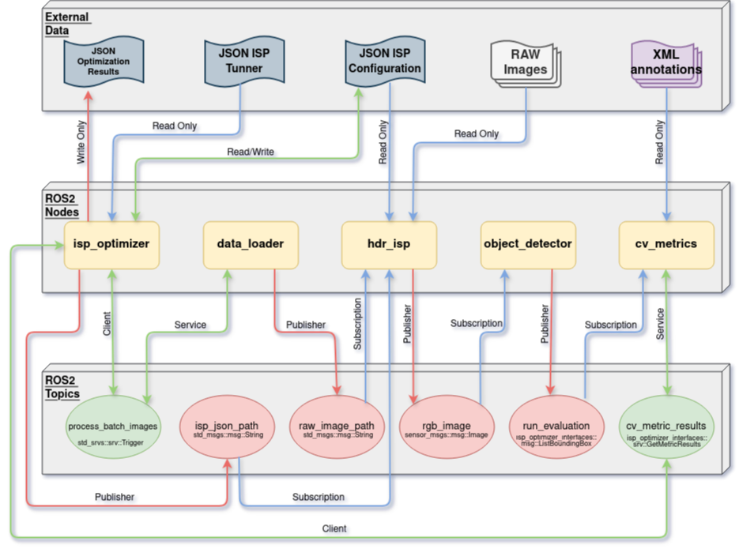

# ROS 2 ISP Optimizer

`ISP Optimizer` is a ROS 2 package that provides a set of nodes that allows the ISP optimization using RAW images as input.
PENDING.

## Computational Graph

## Dependencies

* [ROS 2 Humble](https://docs.ros.org/en/humble/index.html) environment - follow [installation instructions](https://docs.ros.org/en/humble/Installation.html) for your system
* [OpenCV](https://github.com/opencv/opencv) - can be installed with package manager
* PENDING

## Building the project

PENDING

## Running the ISP Optimizer project

PENDING

## Configuring the nodes parameters

PENDING